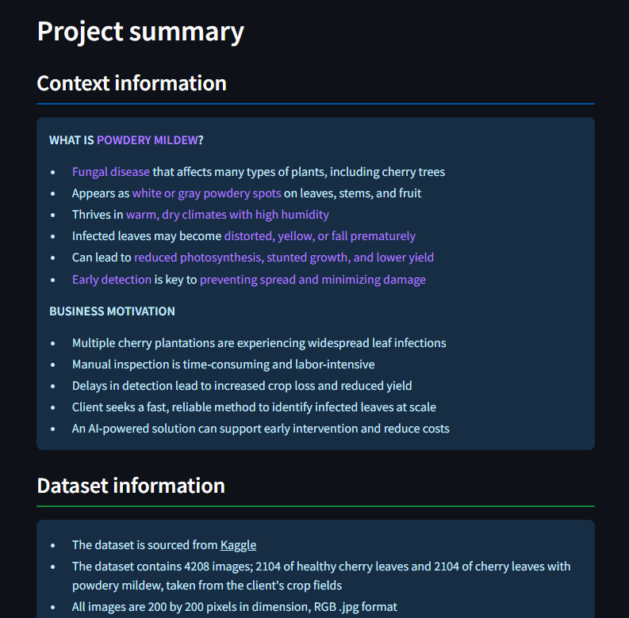
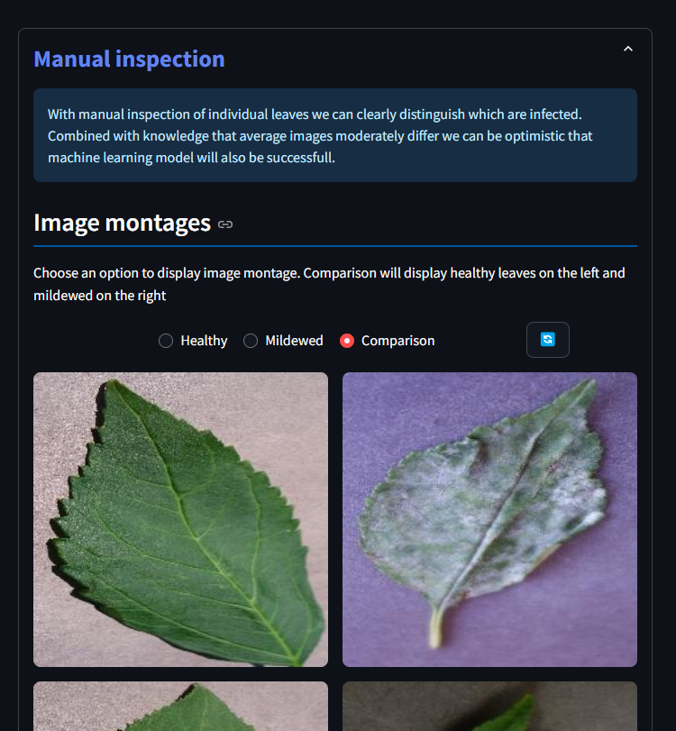
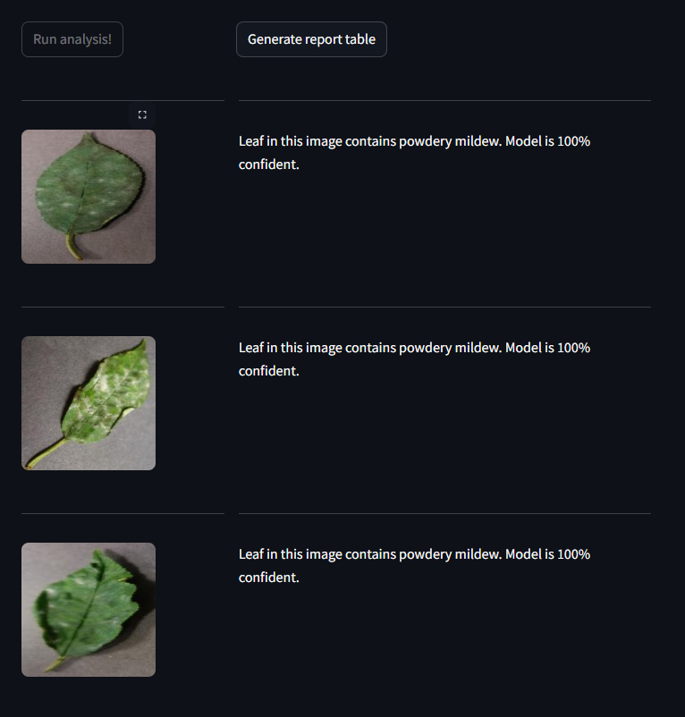
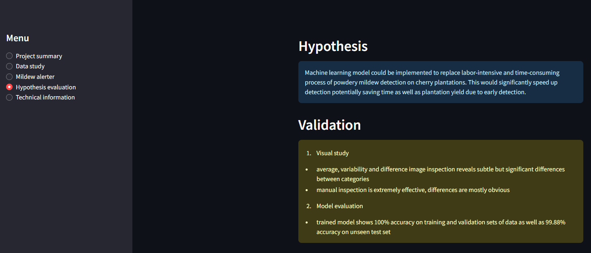
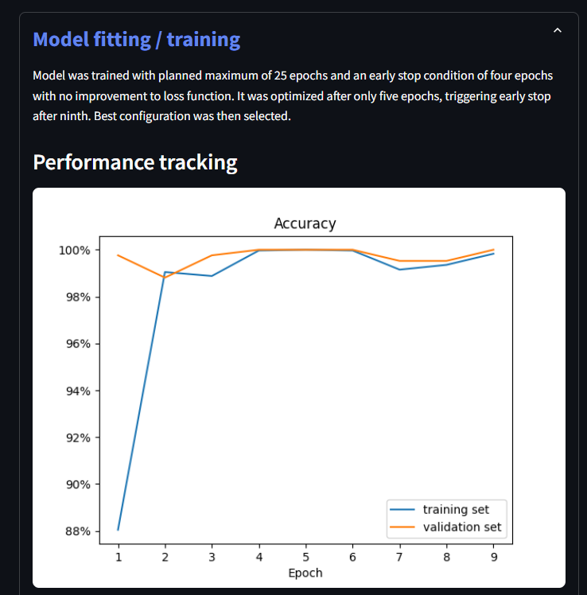

# MILDEW ALERT!

Mildew Alert! is a project that combines data science, machine learning engineering and software development. From collecting and processing cherry leaf image data, to making and training a machine learning model and finally deploying it through a user-friendly Streamlit app, it demonstrates a full pipeline, an end-to-end workflow of turning raw data into an interactive, usable product. You can upload many cherry leaf images and quickly receive information if they contain powdery mildew or not on [live version](https://mildew-alert-5e353bb60aa4.herokuapp.com/).

## Dataset Content

- The dataset is sourced from [Kaggle](https://www.kaggle.com/codeinstitute/cherry-leaves).
- The dataset contains 4208 images; 2104 of healthy cherry leaves and 2104 of cherry leaves with powdery mildew, taken from the client's crop fields.

## Business Requirements

The cherry plantation crop from Farmy & Foods is facing a challenge where their cherry plantations have been presenting powdery mildew. Currently, the process is manual verification if a given cherry tree contains powdery mildew. An employee spends around 30 minutes in each tree, taking a few samples of tree leaves and verifying visually if the leaf tree is healthy or has powdery mildew. If there is powdery mildew, the employee applies a specific compound to kill the fungus. The time spent applying this compound is 1 minute. The company has thousands of cherry trees located on multiple farms across the country. As a result, this manual process is not scalable due to the time spent in the manual process inspection.

To save time in this process, the IT team suggested an ML system that detects instantly, using a leaf tree image, if it is healthy or has powdery mildew. A similar manual process is in place for other crops for detecting pests, and if this initiative is successful, there is a realistic chance to replicate this project for all other crops. The dataset is a collection of cherry leaf images provided by Farmy & Foods, taken from their crops.

- 1 - The client is interested in conducting a study to visually differentiate a healthy cherry leaf from one with powdery mildew.
- 2 - The client is interested in predicting if a cherry leaf is healthy or contains powdery mildew.

## Hypothesis and validation strategy

  ### Hypothesis
  - Machine learning model could be implemented to replace labor-intensive and time-consuming process of powdery mildew detection on cherry plantations. This would significantly speed up detection potentially saving time as well as plantation yield due to early detection.

  ### Validation strategy
  - conduct a visual study to find differences between healthy and infected leaves with the goal of confirming posibility to distinguish them
  - develop and evaluate a machine learning model with the goal of achieving at least 97% accuracy

## The rationale to map the business requirements to the Data Visualisations and ML tasks

- Business requirement 1: Data visualization
    - display and inspect "mean" and "standard deviation" images for both healthy and mildewed leaves
    - display and inspect difference image between average healhy and average mildewed image
    - display image montages and manually inspect for differences

- Business requirement 2: Data classification
    - develop a classification model that accurately distinguishes healthy from mildewed leaves with at least 97% accuracy
    - generate a report with classifications quickly on multiple images

## ML Business Case Assesment

### 1. What are the business requirements?
- The client is interested in conducting a study to visually differentiate a cherry leaf that is healthy from one that contains powdery mildew.
- The client is interested in predicting if a cherry leaf is healthy or contains powdery mildew.

### 2. Is there any business requirement that can be answered with conventional data analysis?
- Yes, we can use conventional data analysis to conduct a study to visually differentiate a cherry leaf that is healthy from one that contains powdery mildew.

### 3. Does the client need a dashboard or an API endpoint?
- The client needs a dashboard.

### 4. What does the client consider as a successful project outcome?
- A study showing how to visually differentiate a cherry leaf that is healthy from one that contains powdery mildew.
- Also, the capability to predict if a cherry leaf is healthy or contains powdery mildew.

### 5. Can you break down the project into Epics and User Stories?
- Information gathering and data collection.
- Data visualization, cleaning, and preparation.
- Model training, optimization and validation.
- Dashboard planning, designing, and development.
- Dashboard deployment and release.

### 6. Ethical or Privacy concerns?
- Client is imaginary and data publicly hosted, no concerns

### 7. Does the data suggest a particular model?
- The data suggests a binary classifier, indicating whether a particular cherry leaf is healthy or contains powdery mildew.

### 8. What are the model's inputs and intended outputs?
- The input is a cherry leaf image and the output is a prediction of whether the cherry leaf is healthy or contains powdery mildew.

### 9. What are the criteria for the performance goal of the predictions?
- We agreed with the client a degree of 97% accuracy.

### 10. How will the client benefit?
- The client will save work time
- The client will detect infection quicker ultimately leading to higher plantation yields

## Dashboard Design

<!-- PAGE 1 -->

  

    <h3>Page 1: Project Summary</h3>
    <ul>
      <li><strong>Status element 1:</strong> General Information</li>
      <li><strong>Status element 2:</strong> Dataset information</li>
      <li><strong>Status element 2:</strong> Business requirements</li>
      <li><strong>Status element 3:</strong> Link to more information</li>
    </ul>
  

  

    
  

<!-- PAGE 2 -->

  

    <h3>Page 2: Cherry Leaf Visualizer</h3>
    <ul>
      <li><strong>Expander 1:</strong> Average and variability images</li>
      <li><strong>Expander 2:</strong> Differences between healthy and infected images</li>
      <li><strong>Expander 3:</strong> Image montage</li>
    </ul>
  

  

    
  

<!-- PAGE 3 -->

  

    <h3>Page 3: Powdery Mildew Classifier</h3>
    <ul>
      <li><strong>Status element:</strong> Usage description</li>
      <li><strong>File uploader:</strong> Allow multiple image upload</li>
      <li><strong>Button 1:</strong> Run classifier and display results</li>
      <li><strong>Button 2:</strong> Generate classification table</li>
      <li><strong>Button 3:</strong> Download report table</li>
    </ul>
  

  

    
  

<!-- PAGE 4 -->

  

    <h3>Page 4: Project Hypothesis and Validation</h3>
    <ul>
      <li><strong>Status element 1:</strong> Project hypothesis</li>
      <li><strong>Status element 2:</strong> Validation steps</li>
      <li><strong>Status element 3:</strong> Conclusion</li>
    </ul>
  

  

    
  

<!-- PAGE 5 -->

  

    <h3>Page 5: ML Performance Metrics</h3>
    <ul>
      <li><strong>Expander 1:</strong> Dataset distribution</li>
      <li><strong>Expander 2:</strong> Model summary</li>
      <li><strong>Expander 3:</strong> Model training</li>
      <li><strong>Expander 4:</strong> Model performance</li>
    </ul>
  

  

    
  

## Unfixed Bugs

- No known unfixed issues

## Deployment

### Heroku

- The App live link is: [Mildew Alert!](https://mildew-alert-5e353bb60aa4.herokuapp.com/)

- The project was deployed to Heroku using the following steps:

  1. Set the runtime.txt "Python version" to a [Heroku-20](https://devcenter.heroku.com/articles/python-support#supported-runtimes) stack currently supported version. For this project is is 3.12
  2. Build minimum requirements.txt file required for deployment function without exceeding 500MB limit
  3. Set Procfile and setup.sh file 
  4. Log in to Heroku and create an App
  5. At the Deploy tab, select GitHub as the deployment method.
  6. Select your repository name and click Search. Once it is found, click Connect.
  7. Select the branch you want to deploy, then click Deploy Branch.
  8. On any errors inspect log and correct accordingly repeating required steps
  9. Click on View App and test

## Main Data Analysis and Machine Learning Libraries

- Here, you should list the libraries used in the project and provide an example(s) of how you used these libraries.

## Credits

- In this section, you need to reference where you got your content, media and from where you got extra help. It is common practice to use code from other repositories and tutorials. However, it is necessary to be very specific about these sources to avoid plagiarism.
- You can break the credits section up into Content and Media, depending on what you have included in your project.

### Content

- The text for the Home page was taken from Wikipedia Article A.
- Instructions on how to implement form validation on the Sign-Up page were taken from [Specific YouTube Tutorial](https://www.youtube.com/).
- The icons in the footer were taken from [Font Awesome](https://fontawesome.com/).

## Acknowledgements (optional)

- Thank the people who provided support throughout this project.